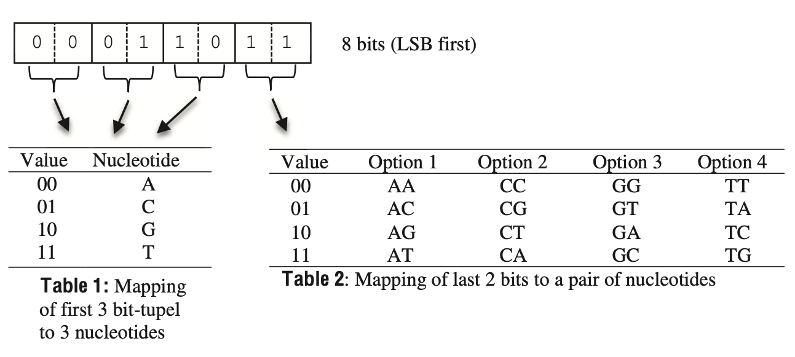
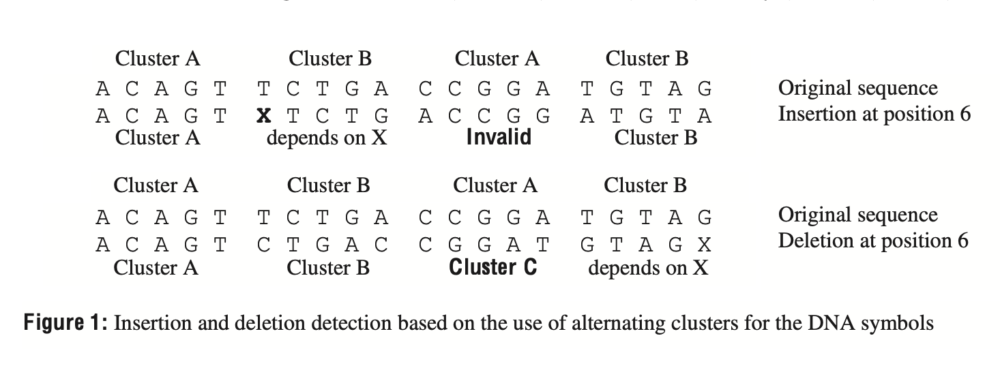

# Experiment of Forward Error Correction for DNA Data Storage

> According to use JavaScript to complete data convert.

## Part 1

> Base data convert

------

### Requiement

#### The following four fundamental problems of the DNA channel had to be tackled

1. Error propagation: A single swap error, should alter bits after demodulation as little as possible. This allows efficient protection of the oligo addresses with a bit-correcting BCH code for a given redundancy.

2. Run-length limitation: Because a sequence of more than 3 identical nucleotides may cause diffi- culties during sequencing of the oligos, the maximum run-length of identical nucleotides shall be limited to 3.

3. Insertion and deletion errors: Since these two error types are quite common for today’s synthesiz- ers and sequencers, means for detecting and correcting insertion and deletion errors are manda- tory.

4. Self-reverse complementariness: Self-reverse complimentary sections within a DNA molecule, potentially causing amplification issues of the corresponding oligo, had to be avoided.

> Mapping of bit-tupels to nucleotides

In order to limit the maximum run-length of identical nucleotides to 3 for any possible combinations of DNA symbols, we defined the following constraints resulting in valid DNA symbols:

-   The first three nucleotides shall not be the same
-   The two last nucleotides shall not be the same

> Insertion and deletion detection based on the use of alternating clusters for the DNA symbols

