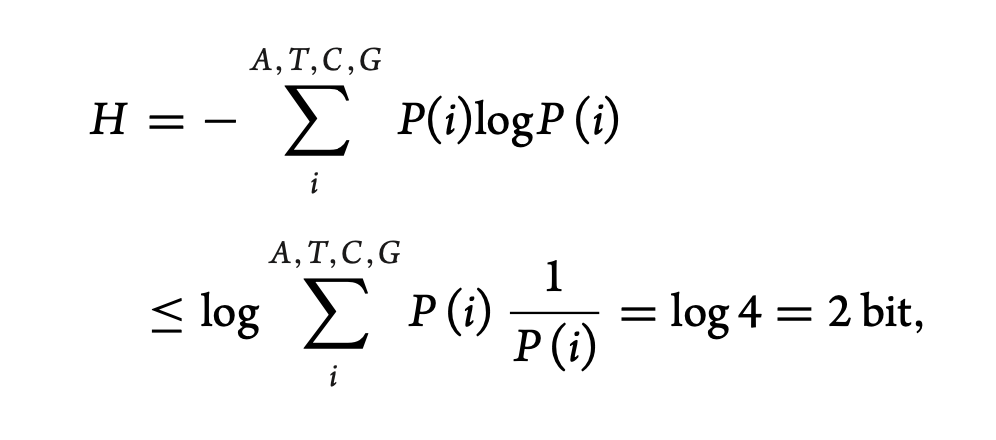
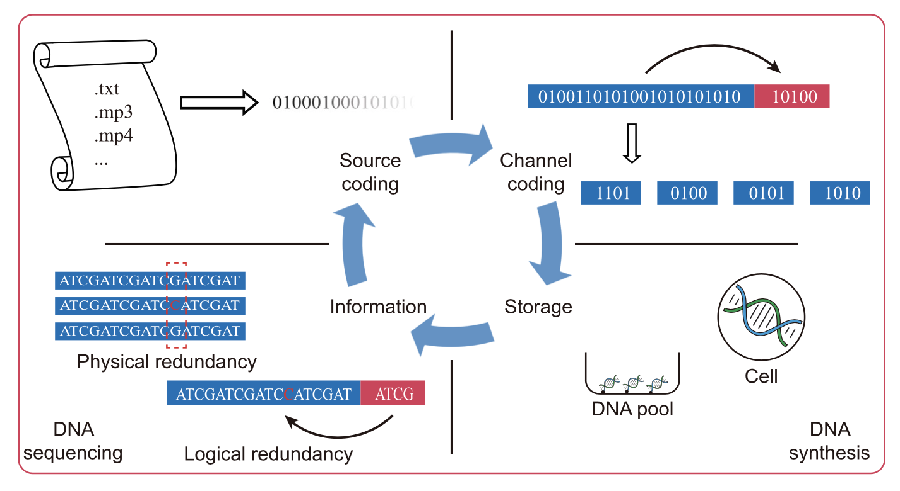
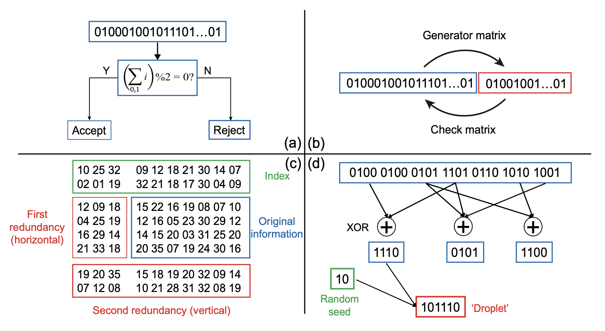
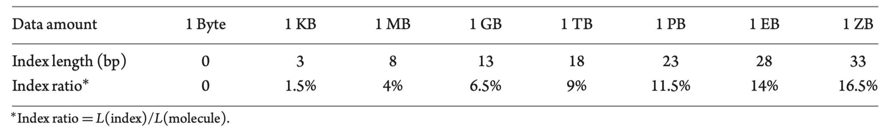
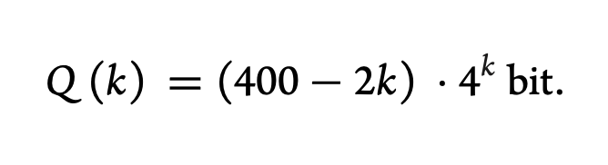
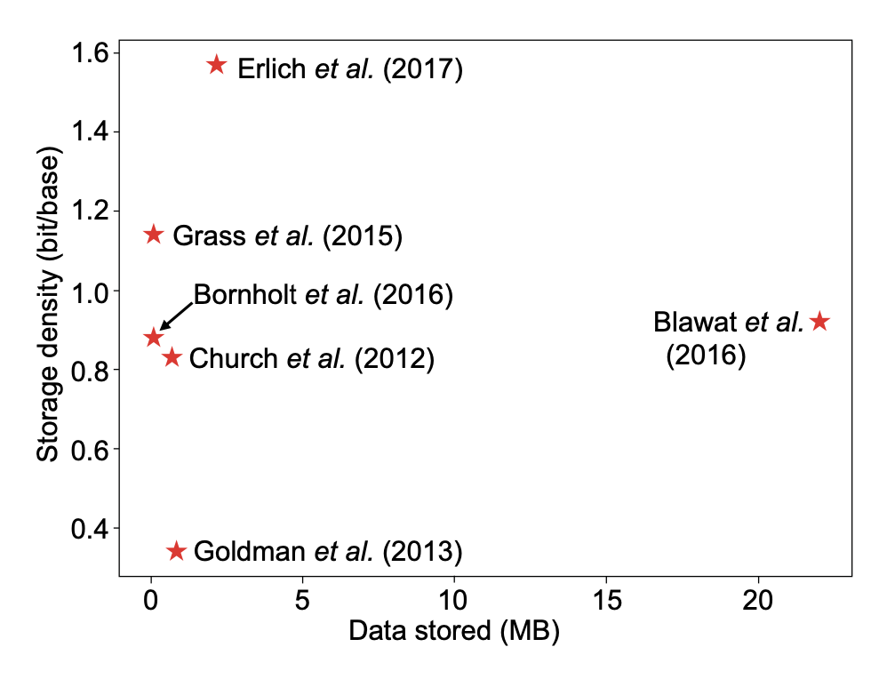
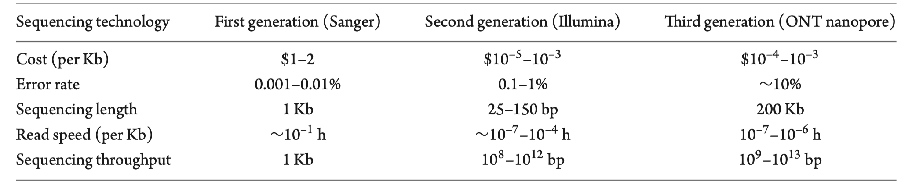

# DNA digital storage technology Assessment and Judgment

Collection and analysis by Yizhe Zhang

## Requirement

1. Which companies are processing research on DNA digital Storage technology?
2. How to convert data for adapting DNA physical limiteds  and which stage is progressing on researching code arithmetics and conservations?
3. What are the up-to-date researching directions in DNA storage technology?

### Q1 Which companies are processing research on DNA digital Storage technology? 1st [*1]

------

Up till now, fifteen tech-based companies and institutions have formed an alliance aimed at advancing DNA data storage by agreeing upon a “roadmap” of definitions and standards to help the industry achieve interoperability between solutions. Its founders are Illumina, Microsoft, Twist Bioscience, and Western Digital. They and 11 other members have committed to addressing the explosive growth of digital data by establishing the foundations of a cost-effective commercial archival storage ecosystem.

DNA provides a stable format storage medium that is durable for thousands of years when properly stored, the Alliance says. DNA enables cost effective and rapid duplication within a tiny space: Ten full-length digital movies can be stored within the equivalent volume of a single grain of salt, though digital data preserved in DNA can be encased in glass beads or stored in capsules or pellets.

The Alliance cited a figure from Gartner projecting that by 2024, 30% of digital businesses will address the exponential growth of data that is poised to overwhelm existing storage technology by mandating DNA storage trials.

“In collaboration with University of Washington, we have demonstrated a fully automated end-to-end system capable of storing and retrieving data from DNA, and we have separately stored 1GB of data in DNA synthesized by Twist and recovered data from it,” Karin Strauss, PhD, senior principal research manager at Microsoft, said in a statement.

Strauss announced the formation of the Alliance today at the **Flash Memory Summit (FMS) 2020 Virtual Conference & Expo**, a three-day storage technology event ending today.

To store data in DNA, a data file is first converted from its digital sequence of 0’s and 1’s into a DNA sequence of A’s, C’s, T’s and G’s. The DNA data file is synthesized in short segments of DNA from 200 to 300 bases long, then stored. Each short segment contains an index to indicate its place within the overall data file. To retrieve the data, the segments are sequenced and decoded back into the original file.

The **DNA indexing system** allows part of the file to be biologically recovered or “random access” before sequencing, so only data of interest is sequenced. Error-correcting algorithms are used during the encode/decode process, enabling all data to be recovered error-free.

Joining Illumina, Microsoft, Twist, and Western Digital as members of the Alliance are:

- **Ansa Biotechnologies**, a DNA synthesis service provider for synthetic biology research.
- **CATALOG**, developer of what it says is the world’s first DNA-based digital data storage and computation platform.
- **The Claude Nobs Foundation,** focused on digital preservation of the audiovisual collection of its namesake, the founder of the Montreux Jazz festival.
- **DNA Script**, developer of SYNTAXTM, the world’s first benchtop DNA printer powered by enzymatic technology.
- **EPFL (École Polytechnique Fédérale de Lausanne)** – Cultural Innovation & Innovation Center (Montreux Jazz Digital Project)
- **ETH Zurich – The Swiss Federal Institute of Technology**
- **Interuniversity Microelectronics Centre (Imec),** an R&D hub for nano- and digital technologies
- **Iridia**, established in 2016 to develop the world’s first commercially-attractive, DNA-based data storage solution
- **Molecular Assemblies**, developer of an enzymatic DNA synthesis technology designed to power DNA-based products for industrial synthetic biology, precision medicine, and emerging applications that include DNA for data information storage
- **Molecular Information Systems Lab** at the University of Washington (UW), a partnership between UW Computer Science, Electrical Engineering, and Microsoft Research

Twist Bioscience Company devised a more efficient panel to save and delivery DNA base. [*2]

They also say DNA enables cost effective and rapid duplication. **That’s not rapid on the same timescale as SSD accesses. The Microsoft and University of Washington demo system had a write-to-read latency of approximately 21 hours for its 5-byte data payload.** The researchers wrote: ”While 5  bytes in 21 hours is not yet commercially viable, there is precedent for many orders of magnitude improvement in data storage.”

Dr. Karin Strauss, senior principal research manager at Microsoft, issued a quote: “**We’re encouraged by the potential for more sustainable data storage with DNA** and look forward to collaborating with others in the industry to explore early commercialisation of this technology.”

### Q2 How to convert data for adapting DNA physical limiteds  and which stage is progressing on researching code arithmetics and conservations?  1st [*3]

------

An article *3 introduced things about follows:

1. *The global demand for data storage is currently outpacing the world’s storage capabilities. DNA, the carrier of natural genetic information, offers a stable, resource- and energy-efficient and sustainable data storage solution.* 
2. *In this review, we summarize the fundamental theory, research history, and technical challenges of DNA storage.* 
3. *From a quantitative perspective, we evaluate the prospect of DNA, and organic polymers in general, as a novel class of data storage medium.* 

Early attempts only stored less than tens of Bytes—a small amount of data with little scalability for practical usages. It was not until **the first 10 years of the twenty-first century** that the groundbreaking work of Church and Goldman led to the return of DNA storage to mainstream interest [*4, *5]. **Church et al. successfully stored up to 659 KB of data in DNA molecules**, while the maximal amount of stored data before this work was less than 1 KB. Goldman et al. stored even more data, reaching 739 KB. It is worth noting that the data stored in the two studies contained **not only texts, but also images, sounds, PDFs, etc., which confirmed that DNA can store a wide variety of data types.**

Church and Goldman’s work led to a research fever of large-scale DNA storage. With increasingly complex compilation methods, the amounts of stored data gradually increased. **By the end of 2018, the maximal amount of data stored in DNA exceeded 200 MB, which was stored in more than 13 million oligonucleotides** [*6]. Along with the development of DNA synthesis and sequencing technologies, new DNA storage methods keep emerging, bringing DNA storage ever closer to practical applications.

**Self-information of DNA molecules** 

According to the definition of Shannon information, the maximal amount of self-information (*H*) that a single base can hold is 

where *P*(*i*) represents the probability of base *i* to occur at any position, and log represents the base 2 logarithm as the bit (binary unit) is usually used as a measurement of digital information[7].

- **IMPLEMENTATION OF DNA STORAGE** 

Figure 1 summarizes the general workflow of the DNA information storage process. 

**Figure 1.** Flow of information in DNA-based information storage. Top left: source coding, i.e. converting information into binary code (or other radix) series. Top right: channel coding, i.e. data error detection/correction coding, providing an error correction/error detection capability by providing additional bits of redundancy. Bottom right: information storage. After the desired DNA molecule is synthesized, it can be stored in vitro or in vivo. Bottom left: information readout. Each part will be detailed in the text. 

**Source coding** 

In the first attempt by Bancroft et al., English letters were directly encoded by base triplets in a manner like the amino acid codon table, for example, ‘AAA’ represents the letter ‘A’ [*9]. Interestingly, **they only used three bases to form a ‘ternary digit’**, while G was reserved for sequencing primers. The method ignored capitalization because three bases can produce a coding space of only 33 = 27 elements, which is just enough to encode 26 letters. And, by the same reason, this encoding scheme does not apply to other data types. 

A pioneering study by Church et al., as the first big volume DNA storage work, used a more scalable approach. **They first converted different files into binary sequences in the HTML format and then converted these into DNA sequences** [15]. In comparison, Goldman et al. applied the Huffman coding scheme in the first step, which employs ternary instead of binary conversion. Huffman coding simultaneously compresses the data and this is the first DNA storage study in which **data compression algorithms** were used.

**Huffman coding** is a foundation of  probability arithmetic. It need to establish a series of probability of characters appear before coding then it can use the list of probabilities to encoding and decoding content. It can effectively **compress data.** [*10]

Huffman coding is the most commonly used in the field of DNA storage. This is a variable-length code that uses shorter codes for high frequency letters and longer codes for low frequency letters to reduce the average code length of the text file. The Huffman coding algorithm is readily applicable to any text file and is compatible with special characters. 

**Channel coding** 

Information distortion often occurs during transmission. For DNA molecules, errors may occur during synthesis, replication and sequencing. There are two ways to recover raw data despite information distortion: physical redundancy and logical redundancy. Physical redundancy entails increasing the copy number of DNA molecules that encode the same information. For example, Goldman et al. used 4-fold redundant DNA molecules to store information in their initial attempts, i.e. in each short DNA molecule of 100 bp long, the first 75 bp overlapped with the previous molecule and the last 75 bp overlapped with the next molecule [*5]. Previous work by Nozomu et al. used different sequences to encode the same information. In the process of mapping the binary 0–1 sequence to DNA bases, a binary number was shifted each time and the corresponding base sequences were obtained. As a result, they were able to encode the same information using four different base sequences [*12]. 

Sequencing coverage also contributes to physical redundancy. In the initial work of Church et al., the sequencing coverage was 3000× [*4]. However, physical redundancy is not sufficient for achieving lossless data transmission. The work of Goldman and Church failed to completely restore all the information. Church et al. found a total of 22 errors in the sequencing results [*4] and Goldman et al. also obtained sequences that cannot be automatically recovered [*5]. In addition, **for large data volumes, physical redundancy imposes a dramatic increase in costs**. 

Another way to correct errors is by **logical redundancy—a method widely used in the communication field**. The general idea of logical redundancy is to add **extra symbols**, called ‘check symbols’ or ‘supervised symbols’, in addition to the symbols encoding information. When the information symbols are incorrect, the check symbols can be **used to detect or correct errors so that the information can be accurately recovered**.

**Figure 2.** Illustrations of channel coding for DNA storage. (a) Hamming code, which can only be used to check one error. (b) Linear block code. (c) RS code. Shown here is the two-round RS code used by Grass et al. [*15]. (d) Fountain code. Shown here is the LT code used by Erlich et al. [*16].

The most commonly used error correction code is the **linear block code (Fig. 2b).** Specifically, if a group of information symbols has a length of k, a check symbol of length r can be added using a specific generator matrix to obtain a linear block code with a code length of n = k + r. Once the generator matrix is selected for a set of codes, the pairing between the information symbols and the check symbols determines whether a codeword is legal or not. The apparent coding efficiency of this code is k/n and the error correction capability scales with r/n = 1 – k/n. **Thus, there is a trade-off between the coding efficiency and the error correction capability.**

The most basic class of linear block codes is the Hamming code (Fig. 2a). Simple as it is, only one error can be detected in each group of code words. **Due to its obvious limitations, the Hamming code has not been used for DNA storage.** Another class of linear block code is called the **cyclic code**, by which each group of codewords is still legal after one cyclic shift. The most widely used type of cyclic code is the Bose–Chaudhuri–Hocquenghem (BCH) code, which is a code class that can correct multiple random errors based on the Galois binary field and its extension. To avoid crossover between the information symbol and the check symbol, one can use a generator polynomial to get a special BCH code, which is called a system code [*17]. 

The **Reed-Solomon (RS) code** that has been applied in DNA storage is a special non-binary BCH code, which has been widely used in **fiber, satellite and deep-sea communication**, etc. [*17]. Grass et al. used the RS codes generated on the Galois Field GF (47) for error correction [*15]. Notably, they added two rounds of RS codes, called the ‘inner code’ and the ‘outer code’, respectively, to map the information symbols along orthogonal directions (Fig. 2c). The outer code also mapped the indices. This type of coding is optimized to correct bursts of errors, such as in the case of consecutive base losses, i.e. sequence degradation. In addition, RS codes were included in the ‘DNA fountain’ system used by Erlich et al., where they were not used for error correction, but for detecting and discarding erroneous sequences [*16]. 

By contrast, fountain coding uses a completely different framework than linear block codes, amounting to a codeless erasure code. The basic idea is to group the signal sources into smaller packets. After obtaining an adequate number of packets, the original information can be successfully restored (Fig. 2d). The main advantage of the fountain code is its extremely **low redundancy** and **it can handle ‘erase’** (deletion and insertion of bases) **errors**. Erlich et al. used the classic Luby Transform Code in the fountain code, i.e. the LT code. If DNA molecules are lost to varying degrees, the LT code can still handle it well through detailed design. Currently, the fountain code may be the only error-correction code in the field of DNA storage that can robustly deal with the loss of DNA molecules. The success of commercial LT codes for digital information (achieving a decoding failure rate <10−8 with <5% redundancy [*18]) has highlighted its potential for DNA storage. 

**Information density of DNA storage**

As shown in the previous section, the upper limit of the information storage density of DNA has been calculated to be about 4.606 × 1020 Bytes/g, but a more practical indicator is the volumetric density. In the initial work of Church et al., the bulk density of DNA molecules was approximated to the density of pure water, **which gave an information density of 4.606 × 1017 Bytes/mm3**. In comparison, the information storage density of classic media, s**uch as flash drives, optical tape and hard disks, is of the order of 109 Bytes/mm3**.

The estimate was made under ‘ideal conditions’, ignoring many practical factors. First, the theoretical bulk density can hardly be reached, as DNA molecules need to be stored in specific environments to prevent degradation. For example, most in vitro DNA storage studies were based on short DNA oligonucleotides (oligos) in a DNA pool, which was dissolved in dilute solution. Second, physical and logical redundancies reduce the actual information density to various extents. Third, a certain length of index is needed in the DNA molecules to provide addresses, which are themselves not available for storing information. 

**Table 1.** Index length required to store different amounts of data with 200-bp DNA molecules. 

Table 1 shows the length of the index required in a 200-bp molecule when storing different amounts of data. When the length of the index in this sequence is k bp, the number of indexable molecules is 4k and the number of bits used to store information is 400–2k per molecule. Therefore, the total storage capacity of the oligo pool is

In reality, it is almost **impossible to store ZB orders of data in a single DNA oligo library**. For example, the dilute solution condition, as is required for efficient information retrieval and amplification, is hardly met, with 433 ≈ 1020 molecules dissolved in a few liters of solution. Another constraint is imposed by the free diffusion of DNA oligos in solution. Although, in the 100 base pair range, the diffusion coefficient of DNA oligos can be higher than 10 μm2/s, the Brownian motion of oligos could not traverse a significant portion of the reaction system in a reasonable reaction time to enable searching of the probes for random access of information, especially in large libraries. Our crude calculations suggest an upper limit of PB information in a 1-liter reaction system. Lastly, the theoretical indexing limit should not be saturated to ensure sufficient specificity of indices against probes. **One possible solution for the storage of large data volumes is to use physically separated DNA pools.** This has not been explored yet, **due to the extremely limited amount of information that has been stored in DNA so far**. However, as DNA storage comes close to real practice, rigorious systems design such as this will be needed. 

**Figure 3.** Amounts of data stored and storage densities achieved in major DNA data storage studies. The storage density refers to the effective density, i.e. the total amount of information stored divided by the total number of bases used (number of oligonucleotides × number of bases per oligonucleotide molecule). The x-axis shows the total amount of data stored. 

Figure 3 shows the amounts of data stored and the data storage densities achieved in major DNA data storage publications since 2012.

- **TECHNICAL ASPECTS AND PRACTICAL CONSIDERATIONS** 

*The past few decades have witnessed the rapid development of DNA synthesis and assembly technologies, which laid the groundwork for the advancement of novel fields and technologies including DNA information storage.* 

Three generations of DNA sequencing technology:

1. The main advantage of this method is its high accuracy, albeit with **a high cost and a low throughput**. Moreover, for the consideration of sequence integrity and synthesis efficiency, the product length is limited to 150–200 bp. 
2. Array-based DNA synthesis is a technique for synthesizing DNA **using a series of electrochemical techniques on microarray chips**. In each cycle, **nucleotides are conjugated to DNA strands at specific locations of the chip**, allowing simultaneous elongation of a heterogeneous pool of oligos. Array-based DNA synthesis significantly improved the speed, efficiency and cost-effectiveness of DNA synthesis. 
3. DNA synthesis techniques are based on enzymatic synthesis. Although still in their infancy, they are expected to **dramatically reduce the time and cost of DNA synthesis**. Lee *et al.* **gave an estimate of 40 s/cycle, which is six times as fast as phosphoramidite synthesis**, and a projected reduction in cost by several orders of magnitudes once their terminal deoxynucleotidyl transferase (TdT) enzymatic reaction system is miniaturized. 

**Table 2**. Comparison of three generations of DNA sequencing technology.

### Q3  What are the up-to-date researching directions in DNA storage technology?

------

**Prospects and challenges** 

- **The cost of writing and reading information is still prohibitively high and the efficiency of storing data is too low.** However, DNA synthesis and sequencing costs have been reduced by 10-million-fold over the past 30 years, and the trend will continue to meet the needs of practical DNA storage in the foreseeable future [*19,*20]. It is predicted by the Molecular Information Storage Program that **DNA synthesis cost will reduce to $10−10/bp by 2023** [*21].  At the same time, the read and write speeds have gradually increased. In their original study (2012), Church *et al.* concluded that DNA synthesis and sequencing technologies require improvements of 7–8 and 6 orders of magnitude, respectively, to compete with current information read and write speeds [*4]. The data presented by Goldman et al. show that the main contributor to the cost of DNA storage is synthesis and, based on their calculations, **if the cost of synthesis is reduced by another 2 orders of magnitude (compared to 2013), DNA storage will outperform magnetic medium storage for decade-long data storage** — a goal that could be achieved in just a few years [*5].  
- **Random access is another function necessary for information storage purposes.** PCR is typically performed using specific primers to obtain selective information stored in DNA. For long-chain DNA storage, PCR with appropriate primers **upstream and downstream of the desired information** will suffice. However, for oligo DNA storage systems, **the entire library needs to be sequenced and assembled before fragmental information can be acquired**. 
- **Techniques to erase and rewrite information** in DNA remain to be developed. Existing DNA storage methods support one-time storage only and thus are suitable for information that does not need to be modified, such as government documents and historical archives. However, the continuous development of synthetic biology has shown the possibility of solving this problem. Artificial gene circuits with stable DNA encoding functions have been designed. For example, u**sing a ‘Set’ system of recombinant enzymes and a ‘Reset’ system of integrase and its excision partner,** a controllable and rewritable switch could be implemented [*22]. 

## **Conclusion**

About Coding:

1. DNA digital storage more suited in conserving some regular content. Because of using **Huffman coding** to decrease content size.

About recent problems and researching direction:

1. How to decrease cost of option of DNA sequences and increase writing and reading speed.
2. How to decrease the amount of errors and correct errors.
3. How to convert data to DNA sequences more effective and tiny.
4. How to approach random access on DNA sequences. 
5. How to achieve erase and rewrite information in DNA sequences.

## Reference information

1. [Illumina, Microsoft, Twist Lead New DNA Data Storage Alliance](https://www.genengnews.com/news/illumina-microsoft-twist-lead-new-dna-data-storage-alliance/)
2. [Twist Bioscience - DNA Synthesis Technology](https://www.youtube.com/watch?v=Dwrte-CBomw)
3. [DNA storage: research landscape and future prospects](https://academic.oup.com/nsr/article/7/6/1092/5711038)
4. Church GM, Gao Y and Kosuri S. Next-generation digital information storage in DNA. Science 2012; **337**: 1628. 
5. Goldman N, Bertone P and Chen S et al. Towards practical, high-capacity, low-maintenance information storage in synthesized DNA. Nature 2013; **494**: 77–9. 
6. Organick L, Ang SD and Chen Y et al. Random access in large-scale DNA data storage. Nat Biotechnol 2018; **36**: 242–8. 
7. Imre C. Information Theory: Coding Theorems for Discrete Memoryless Systems. Cambridge: Cambridge University Press, 2016. 
8. Ariyus D and Ardiansyah. Optimization substitution cipher and hidden plaintext in image data using LSB method. J Phys Conf Ser 2019; **1201**: 012033. 
9. Bancroft C, Bowler T and Bloom B et al. Long-term storage of information in DNA. Science 2001; **293**: 1763–5. 
10. [Huffman coding](https://en.wikipedia.org/wiki/Huffman_coding)
11. [Empty]
12. Yachie N, Sekiyama K and Sugahara J et al. Alignment-based approach for durable data storage into living organisms. Biotechnol Prog 2007; **23**: 501–5. 
13. [Empty]
14. [Empty]
15. Grass RN, Heckel R and Puddu M et al. Robust chemical preservation of digital information on DNA in silica with error-correcting codes. Angew Chem Int Ed 2015; **54**: 2552–5. 
16. Erlich Y and Zielinski D. DNA fountain enables a robust and efficient storage architecture. Science 2017; **355**: 950–4. 
17. Imre C. Information Theory: Coding Theorems for Discrete Memoryless Systems. Cambridge: Cambridge University Press, 2016. 
18. Luby M. LT code. In: Proceeding of the 43rd Annual IEEE Symposium on Foundations of Computer Science. New York: IEEE, 2002, 271–82. 
19. Wetterstrand KA. National Human Genome Research Institute. DNA sequencing costs: data from the NHGRI Genome Sequencing Program (GSP). http://www.genome.gov/sequencingcosts (10 February 2020, date last accessed). 
20. Shokralla S, Jennifer L and Spall J et al. Next generation sequencing technologies for environmental DNA research. Mol Ecol 2012; **21**: 1794–805. 
21. Itaya M, Tsuge K and Koizumi M et al. Combining two genomes in one cell: stable cloning of the Synechocystis PCC6803 genome in the Bacillus subtilis 168 genome. Proc Natl Acad Sci USA 2005; **102**: 15971–6. 
22. Bonnet J, Subsoontorn P and Endy D. Rewritable digital data storage in live cells via engineered control of recombination directionality. Proc Natl Acad Sci USA 2012; **109**: 8884–9. 